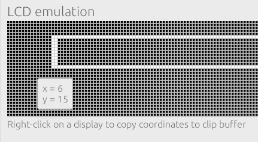

# rugui: GUI library for microcontrollers written in Rust

The project goal is to make a modern GUI library for microcontrollers in Rust. Currently, the library can only draw primitives on the abstract framebuffer. If you want to use this on an actual display, you need to implement a driver, which will send a framebuffer to display.

🚧*This project is experimental. Any help is welcomed, but don't expect to use this in production*🚧

What is implemented:
* Points, lines
* Rectangles
* Circles
* Horizontal progress bar
* Vertical scroll bar

## Emulator
We've also implemented a beautiful emulator based on [egui](https://github.com/emilk/eguihttps://github.com/emilk/egui).

Currently, it's emulating a black-and-white 160 x 32 screen.

The goal of the emulator is not just to emulate a screen but also to help the debugging process. Or even help with building layouts completely in a GUI in the future.

Thanks to the web technologies and Rust's support of Web Assembly, you can [run the emulator in a browser](https://gordon01.github.io/rugui-emulator/).

## Why not [embedded-graphics](https://github.com/embedded-graphics/embedded-graphics)?
embedded-graphics is a very mature and ready for a production project. However, we believe that we can do better, and the non-buffered iterator approach may not be the best idea in some places. I hope that we will do benchmarks in the future. However, we can still reuse their display drivers.
